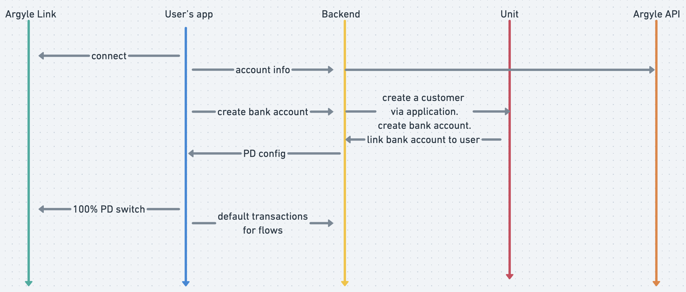

Bank App combines the power of [Argyle's](https://www.argyle.com) user-permissioned payroll connectivity, [Unit's](https://www.unit.co/) powerful banking services, and [Stytch's](https://stytch.com) passwordless authentication platform. These components create a cohesive set of financial services, all built around income and employment data to enhance the way people manage their finances.

The following features and financial services are showcased within Bank App:

- Connecting work accounts
- Tracking income
- Linked checking and savings accounts
- Switching direct deposit to GoodBank cards
- Providing Earned Wage Access
- Additional credit products
- Job recommendations

You can try out the Bank App demo [here](https://sampleapps.argyle.com/bank) and learn more about the features [here](https://docs.argyle.com/guides/docs/bank-app).


## Getting Started

1. Rename `env.example` to `.env` and fill in Argyle related keys from your https://console.argyle.com account. Stytch and Unit information is optional.

2. Install the dependencies
```bash
npm install
# or
yarn install
```

3. Run the development server:

```bash
npm run dev
# or
yarn dev
```

4. Open [http://localhost:3000](http://localhost:3000) with your browser to see the result.

## Architecture



* Contexts/auth - HOC (higer order component) to protect pages in case the user did not finish onboarding and redirect the user to the appropriate flow in case a wrong url was entered.
* Hooks - used to encapsulate more complex logic; to provide fast and seamless transitions (loading state so user can see animated skeleton loaders); caching when same network calls are required for multiple components.
* Layouts - define base types of page layouts: whether tabs should be shown or stacked-navigation style should be used.
* Models - data models defining the most important structures.
* Pages:
    * API for all backend functionality that's hidden from end-user. To not expose any keys or potentially abusive calls.
    * Other folders represent different flows (basically separated by tabs).
* Stores - [zustand](https://github.com/pmndrs/zustand) is used since it provides a simple yet scalable storage solution. Storage is split into decoupled slices separated by logical flows. All actions are defined in relevant slices. The global store contains parameters that are essential for the whole app, i.e. isPdConfigured or userId.
* Components - dumb components that do not carry their own state but rather use what is provided via props.
* Views - smart views that have their own state, business logic and are reused over multiple screens.

[tailwindcss](https://tailwindcss.com/) was chosen for styling as it provides rapid and easy on-the-go styling. `tailwind.config.js` file contains custom styling presets like fonts and colors.

[currency](https://currency.js.org/) is used for all currency related transformations and calculations. All currency-related results in that are stored locally are in cents (integers) to avoid any potential nuances with non-integer number manipulations.

[moment](https://momentjs.com/) helps to deal with date manipulations and transformations.

## Flows

* Home
* Income
* Accounts
* Card
* Early Pay
* Credit
* Work
